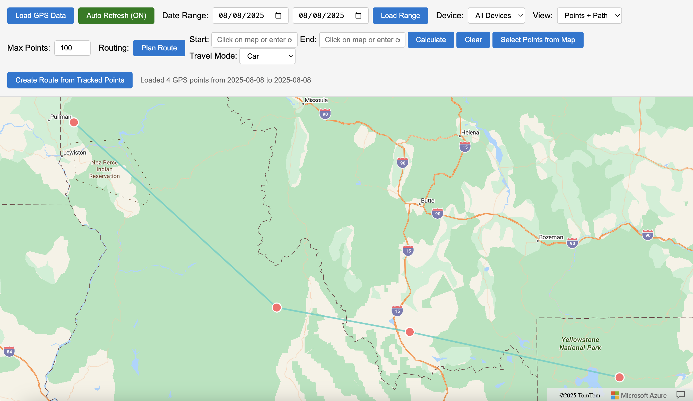
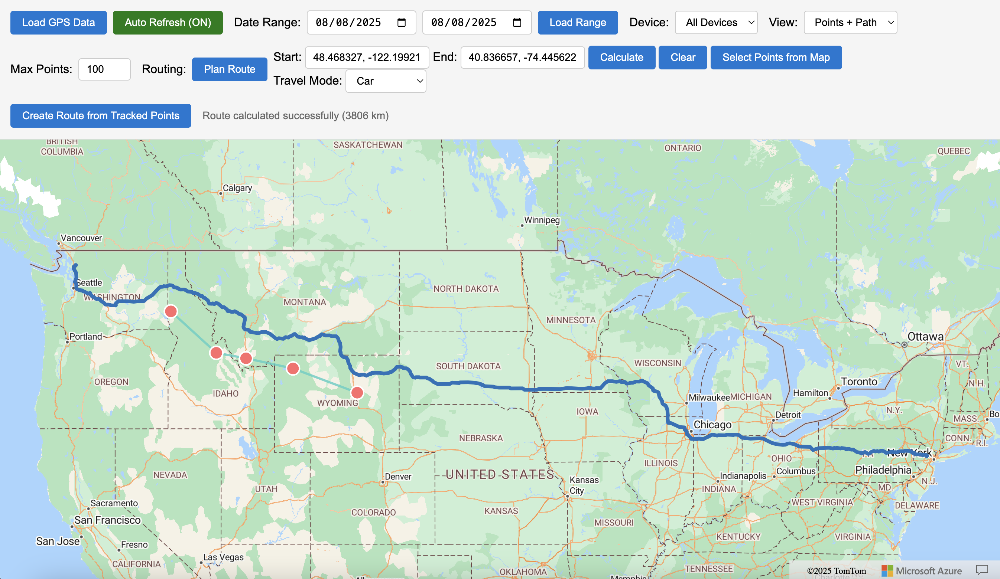
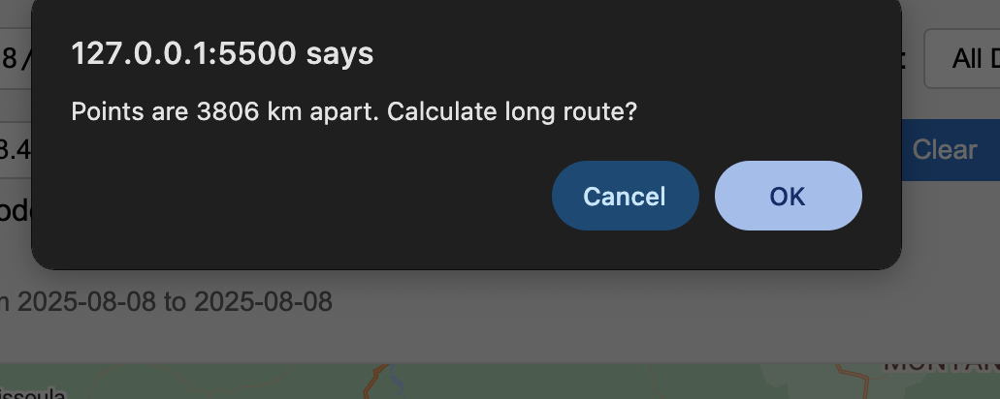

# 🛰️ Azure GPS Tracking & Geofencing System


## Core Functionalities

### 📍 Real-Time GPS Tracking

- **Device Agnostic Ingestion**: Processes data from any GPS-enabled device via Azure IoT Hub
- **High-Frequency Updates**: Handles up to 1000 location pings/minute per device
- **Precision Mapping**: Visualizes coordinates with 5-meter accuracy on Azure Maps
- **Multi-Protocol Support**: Accepts data in JSON, Protobuf, and CSV formats

### 🚨 Intelligent Geofencing

- **Dynamic Zone Management**:
  - Polygon geofences with up to 100 vertices
  - Radius-based circular boundaries (50m-50km range)
  - Nested zone configurations (parent/child relationships)
  
- **Instant Alerts**:
  - Email notifications via SendGrid integration
  - SMS alerts through Twilio bridge
  - Webhook support for custom integrations
  - Configurable dwell time (0s-24h) before triggering

### 📊 Advanced Visualization
- **Interactive Web Dashboard**:
  - Leaflet.js-based map rendering
  - Three view modes: Points/Path/Combined
  - Device-specific filtering
  - Customizable heatmaps

- **Temporal Analysis**:
  - Date-range filtering (hourly/daily/monthly)
  - Speed/distance calculations
  - Stop detection algorithm (5-minute dwell threshold)

### 🛣️ Route Intelligence


- **Path Reconstruction**:
  - Map-matching for noisy GPS data
  - Speed-based point decimation
  - Missing data interpolation

- **Route Planning**:
  - Azure Maps routing engine integration
  - Multi-point route optimization
  - Travel mode selection (car/truck/pedestrian)
  - Traffic-aware ETAs

## Technical Specifications

| Component          | Technology Stack                    |
|--------------------|-------------------------------------|
| Backend Processing | Azure Functions (Python 3.8)        |
| Data Storage       | Azure Blob Storage (GeoJSON format) |
| Real-Time Stream   | Azure Event Hubs (1000+ msg/sec)    |
| Frontend           | Vanilla JS + Azure Maps SDK         |
| Alerts             | SendGrid + Azure Logic Apps         |

## Data Flow

```mermaid
sequenceDiagram
    Device->>IoT Hub: GPS Coordinates (1s-60s interval)
    IoT Hub->>Event Hub: Fan-out to processors
    Event Hub->>Azure Function: Trigger processing
    Azure Function->>Blob Storage: Archive raw data
    Azure Function->>Geofence Engine: Boundary check
    Geofence Engine->>Alert System: Trigger notifications
    Azure Function->>Web Dashboard: Real-time update
